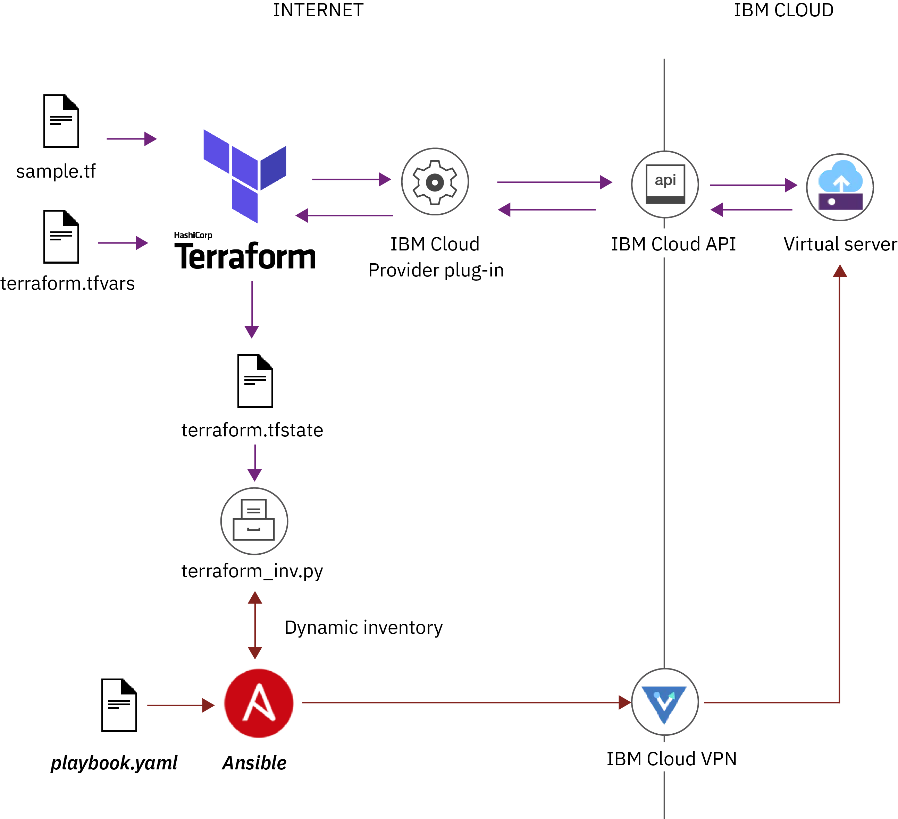

---

copyright:
  years: 2017, 2019
lastupdated: "2019-01-22"

---

{:new_window: target="_blank"}
{:shortdesc: .shortdesc}
{:screen: .screen}
{:pre: .pre}
{:table: .aria-labeledby="caption"}
{:codeblock: .codeblock}
{:tip: .tip}
{:download: .download}

# Using Ansible to automate app deployment on Terraform-provided infrastructure
{: #ansible}

**What is Ansible?** </br>
[Ansible ](https://www.ansible.com/) is a configuration management and provisioning tool, similar to [Chef ](https://www.chef.io/chef/) and [Puppet ](https://puppet.com/), and is designed to automate multitier app deployments and provisioning in the cloud. Written in Python, Ansible uses YAML syntax to describe automation tasks, which makes Ansible easy to learn and use. 

**How does Ansible work?** </br>
Ansible does not use agents or a custom security infrastructure that must be present on a target machine to work properly. Instead, Ansible connects to compute hosts over the private network by using SSH keys. The SSH key can be preconfigured on the virtual server instance (VSI) when you order the infrastructure in {{site.data.keyword.Bluemix_notm}} so that you can use Ansible right away after your VSI is provisioned. You can choose to create your own SSH key and upload this SSH key to your {{site.data.keyword.Bluemix_notm}} portal. 

Ansible models software packages, configuration, and services as resources on a managed host to ensure that the resource is in a specific state. To bring a resource to the desired state, Ansible pushes modules to the managed host to run the required tasks. After the tasks are executed, the result is returned to the Ansible server and the module is removed from the managed host. You can use Ansible modules to execute a specific operation or group scripts and configurations in an Ansible playbook that you can execute. Ansible modules are idempotent such that executing the same playbook or operation multiple times returns the same result as resources are changed only if required. 

For more information about Ansible, see:
- [Ansible documentation ](https://docs.ansible.com)
- [Ansible introduction ](https://www.tutorialspoint.com/ansible/ansible_introduction.htm)
- [Ansible2 tutorial ](https://serversforhackers.com/c/an-ansible2-tutorial)

</br>
**How do Ansible and Terraform work together?** </br>
Ansible and Terraform are complimentary solutions, each addressing a key area of app and environment management. Terraform provides lifecycle management of infrastructure whereas Ansible helps you to provision and configure apps. 

## Setting up a VPN connection and SSH authentication to access IBM Cloud infrastructure
{: #setup_vpn}

To securely connect to your virtual machines over the private network with Ansible, you must configure VPN access for your infrastructure resources and on your local machine, and upload SSH keys to securely authenticate with your infrastructure resources.  
{: shortdesc}

1. Configure your infrastructure user for VPN access
   1. Log in to the [{{site.data.keyword.Bluemix_notm}} infrastructure](https://cloud.ibm.com/classic) portal. 
   2. Select **Account** > **Access (IAM)**. 
   3. Select your user name. 
   4. On the **User details** tab, find the **VPN password** section. 
   5. If no password is set yet, enter a VPN password. 
   6. Copy the VPN user name as you need it later. 
2. Install the VPN client on your local machine. 
   1. Install the Motion Pro Plus client on your local machine. See the instructions for [Linux](https://knowledgelayer.softlayer.com/procedure/ssl-vpn-linux), [macOS](https://knowledgelayer.softlayer.com/procedure/ssl-vpn-mac-os-x-1010), and [Windows](https://knowledgelayer.softlayer.com/procedure/ssl-vpn-windows) for more information for your operating system. (the links are broken, and need update ASAP)
   2. In your VPN connection profile, enter the following values. 
      - **Title**: Enter a name for your connection profile. You can enter any name that you want. 
      - **Gateway**: Choose one of the [data center VPN portals in {{site.data.keyword.Bluemix_notm}}](https://www.softlayer.com/VPN-Access) and retrieve their fully qualified domain name in the format `vpn.xxx.softlayer.com` by clicking the portal link.
      - **Username**: Enter the VPN user name that you noted earlier. 
3. Upload an SSH key to the {{site.data.keyword.Bluemix_notm}} infrastructure portal. 
   1. Generate an SSH key. The SSH key is used to access IBM Cloud infrastructure resources during provisioning. Enter the email address that you want to associate with your SSH key. Make sure to accept the default file name, file location, and missing passphrase by pressing Enter.
      ```
      ssh-keygen -t rsa -b 4096 -C "<email_address>"
      ```
      {: pre}
      
      Example output:
      ```
      Generating public/private rsa key pair.
      Enter file in which to save the key (/root/.ssh/id_rsa): 
      Created directory '/root/.ssh'.
      Enter passphrase (empty for no passphrase): 
      Enter same passphrase again: 
      Your identification has been saved in /root/.ssh/id_rsa.
      Your public key has been saved in /root/.ssh/id_rsa.pub.
      The key fingerprint is:
      SHA256:67LDt8zjbPoX+uKFGrVs2CrsyNk1izzBOkDf8tBb3Xc myemail@example.com
      The key's randomart image is:
      +---[RSA 4096]----+
      |                 |
      |                 |
      | .               |
      |. ..o   S .      |
      |.  +oo * =.. . E |
      | . o+oB B.... .  |
      | .o=+=+%*..      |
      |  +o=o*@X*.      |
      +----[SHA256]-----+
      ```
      {: screen}
      
   2. Verify that the SSH key is created successfully. The creation is successful if you can see one `id_rsa` and one `id_rsa.pub` file.
      ```
      /root/.ssh && ls
      ```
      {: pre}
      
      Example output:
      ```
      id_rsa      id_rsa.pub
      ```
      {: screen}
      
   3. [Add the SSH public key to the {{site.data.keyword.Bluemix_notm}} infrastructure portal](https://console.cloud.ibm.com/docs/infrastructure/ssh-keys/add-ssh-key.html#adding-an-ssh-key).  


## Setting up Ansible on your local machine
{: #setup_ansible}

To use Ansible to execute operations on a virtual server in {{site.data.keyword.Bluemix_notm}}, you must install Ansible on your local machine. 
{: shortdesc}

Looking for instructions for how to update or remove Ansible? See [updating Ansible](#update_ansible) and [removing Ansible](#remove_ansible) for more information. 
{: tip}

### Installing Ansible
{: #install_ansible}

Install Ansible on your local machine to automate the deployment of your apps. 
{: shortdesc}

1. Install [Python version 3.6 or later](https://www.python.org/downloads/). 
2. Install the Python package manager `pip`. Use the same version that you used when you installed Python. The following example assumes that you downloaded Python version 3.6 and want to install pip version 3.6. 
   ```
   python3.6 -m pip install 3.6
   ```
   {: pre}

3. Install Ansible on your local machine. 
   ```
   sudo pip install ansible
   ```
   {: pre}
   
4. Verify that Ansible is installed on your machine. 
   ```
   ansible --version
   ```
   {: pre}
   
   Example output: 
   ```
   ansible 2.7.0
   config file = None
   configured module search path = ['/Users/user/.ansible/plugins/modules', '/usr/share/ansible/plugins/modules']
   ansible python module location = /Library/Frameworks/Python.framework/Versions/3.6/lib/python3.6/site-packages/ansible
   executable location = /Library/Frameworks/Python.framework/Versions/3.6/bin/ansible
   python version = 3.6.6 (v3.6.6:4cf1f54eb7, Jun 26 2018, 19:50:54) [GCC 4.2.1 Compatible Apple LLVM 6.0 (clang-600.0.57)]
   ```
   {: screen}
 
### Updating Ansible
{: #update_ansible}

You can update Ansible to the latest version. 
{: shortdesc}

1. Update Ansible. 
   ```
   pip install ansible --upgrade
   ```
   {: pre}

2. Verify that Ansible is updated. 
   ```
   ansible --version
   ```
   {: pre}

### Removing Ansible 
{: #remove_ansible}

Remove Ansible from your local machine if you do not want to use it anymore. 
{: shortdesc}

1. Uninstall Ansible. 
   ```
   pip uninstall ansible
   ```
   {: pre}
   
2. Verify that Ansible is removed. 
   ```
   pip freeze
   ```
   {: pre}
   
## Running Ansible operations on Terraform-deployed infrastructure
{: #run_ansible}

Use Ansible playbooks to connect to your infrastructure resources, run operations against your infrastructure, and automate the deployment of software components. 
{: shortdesc}

Before you begin: 
- [Complete the Terraform getting started tutorial](/docs/terraform/index.html) to install Terraform, configure the {{site.data.keyword.Bluemix_notm}} Provider plug-in and provision a virtual server in {{site.data.keyword.Bluemix_notm}}. 
- [Set up a VPN connection to your {{site.data.keyword.Bluemix_notm}} infrastructure resources and upload SSH keys](#setup_vpn). 
- [Install Ansible](#install_ansible) on your local machine.

To run Ansible operations against your infrastructure:

1. Create an Ansible project directory and navigate into the directory.
   ```
   mkdir ansible-apache && cd ansible-apache
   ```
   {: pre}
   
2. Create an Ansible configuration file that is named `ansible.cfg` with the following content. In this example, SSH **host_key_checking** is disabled to avoid errors during SSH login as virtual servers in {{site.data.keyword.Bluemix_notm}} can reuse IP addresses when they are deleted and re-created. For more information, see [Host Key Checking](https://docs.ansible.com/ansible/latest/user_guide/intro_getting_started.html#host-key-checking). 
   ```
   [defaults]
   host_key_checking = false
   ```
   {: codeblock}
   
3. [Decide how you want to import the infrastructure inventory into Ansible](#create_inventory) and configure Ansible accordingly. 

4. Ping your virtual servers to test the connection. 
   ```
   ansible -i ./hosts all -m ping
   ```
   {: pre}
   
   Example output: 
   ```
   ws01 | SUCCESS => {
        "changed": "false",
	"ping": "pong"
   }
   ```
   {: screen}

5. Create an Ansible playbook file that is named `apache.yml` with the following content. In this example, you set up and start an Apache web server on your virtual server.
   ```
   ---
   - hosts: all
     tasks:
       - name: ensure httpd is at the latest version
         apt: name=httpd state=latest
       - name: start httpd
         service:
             name: httpd
             state: started
   ```
   {: codeblock}
   
5. Run the playbook against your virtual server.  

   - Example for running code against a specific virtual server named `ws01`. The private IP address of the server is retrieved by using the dynamic inventory list. 
     ```
     ansible-playbook -i ./inventory apache.yml -host ws01
     ```
     {: pre}
     
   - Example for running code against an Ansible host group named `webservers`. The private IP addresses of the servers are retrieved by using the dynamic inventory list. 
     ```
     ansible-playbook -i ./inventory apache.yml -limit webservers
     ```
     {: pre}
   
   - Example for running code against all hosts that are defined in a `hosts` file. 
     ```
     ansible-playbook -i ./hosts apache.yml
     ```
     {: pre}
     
   - Example for running code against an Ansible host group named `webservers`. The private IP addresses of the servers are retrieved from the `hosts` file. 
     ```
     ansible-playbook -i ./hosts apache.yaml -limit webservers
     ```
     {: pre}
     
   Example output: 
   ```
   PLAY [all] ****************************************
   
   TASK [Gathering Facts] ****************************
   ok: [ws01]
   
   TASK [Ensure httpd is at the latest version] ******
   changed: [ws01]
   
   TASK [start httpd] ********************************
   changed: [ws01]
   
   PLAY RECAP ****************************************
   ws01        : ok=3 changed=2 unreachable=0 failed=0
   ```
   {: screen}


## Creating a Terraform infrastructure inventory for Ansible
{: #create_inventory}

For Ansible to provision apps on Terraform-deployed infrastructure, details about the infrastructure components must be imported into Ansible. 
{: shortdesc}

**How does it work?** </br>
Ansible executes code against multiple hosts at the same time. To retrieve the host's private IP address, Ansible uses an inventory list that includes information for how to connect to each virtual server. By default, this inventory file is named [`hosts`](#specify_hosts) and is stored in the Ansible project directory. You can also use the {{site.data.keyword.Bluemix_notm}} Terraform inventory script to [import the infrastructure information from your Terraform `terraform.tfstate` file](#import_from_terraform). 

### Specifying the virtual servers in a `hosts` file
{: #specify_hosts}

You can specify the hosts that you want to target in a `hosts` file and store this file in your Ansible project directory. 
{: shortdesc}

Specifying the virtual servers in a `hosts` file is a good way to get started with Ansible and in cases where your infrastructure does not change. The `hosts` file is a static file and must be changed every time that you add or remove a virtual server. If your infrastructure changes often or if you use Terraform to provision your infrastructure, you can [import infrastructure information directly from Terraform](#import_from_terraform). 

1. In your Ansible project, create a file that is named `hosts` with the following content. The **ansible_user** is set to `root` to force Ansible to log in to your virtual server as root. If `root` is not specified, Ansible uses the user ID from your local machine to attempt to log in to your virtual server. 

   Example for adding a virtual server: 
   ```
   ws01 ansible_host=<private_IP_address> ansible_user=root 
   ```
   {: codeblock}

   Example to add a virtual server as part of an Ansible host group named `webservers`: 
   ```
   [webservers]
   
   ws01 ansible_host=<private_IP_address> ansible_user=root
   ```
   {: codeblock}
  
2. Create the Ansible inventory list. 
   ```
   ansible-inventory -i ./hosts --list
   ```
   {: pre}
   
   Example output: 
   ```
   {
      "_meta": {
          "hostvars": {
	      "wd01": {
		 "ansible_host": "10.72.137.148",
		 "ansible_user": "root"
	      }
	  }
      },
      "all": {
         "children": [
	     "ungrouped"
	     "webservers"
	  ]
      },
      "ungrouped": {},
      "webservers": {
           "hosts": [
	       "ws01"
	   ]
      }
   }
   ```
   {: screen}
	       
     
### Importing infrastructure information from Terraform
{: #import_from_terraform}

Use the {{site.data.keyword.Bluemix_notm}} Terraform inventory script to import infrastructure information from your Terraform `terraform.tfstate` file directly. 
{: shortdesc}

Looking to group your Terraform infrastructure resources for Ansible so that you can execute code against a group of hosts rather than targeting individual machines? Make sure to create your virtual servers with a group attribute. 
{: tip}

The following image shows the components of Terraform and Ansible. Ansible uses the inventory process that is defined in the `terraform_inv.py` script to read the state of the provisioned infrastructure from the `terraform.tfstate` file. To find the `terraform.tfstate` file, you must specify the location of the file in the `terraform_inv.ini` file. This integration point between the two provisioning tools allows dynamically allocated IP addresses, host names and infrastructure details to be passed to Ansible.



To import the Terraform infrastructure inventory into Ansible: 

1. In your existing Ansible project directory, create a directory that is named `inventory`.
   ```
   mkdir inventory
   ```
   {: pre}
   
2. Download the {{site.data.keyword.Bluemix_notm}} Terraform inventory package to a temporary folder on your local machine.  
   ```
   git clone https://github.com/IBM-Cloud/terraform-provider-ibm.git
   ```
   {: pre}
   
3. Navigate into the `ibm_ansible_dyn_inv` directory.
   ```
   cd terraform-provider-ibm/examples/ansible/ibm_ansible_dyn_inv
   ```
   {: pre}
   
4. Prepare your Ansible project folder for the {{site.data.keyword.Bluemix_notm}} Terraform inventory script. 
   1. Copy the `terraform_inv.py` file from the package into the `inventory` directory that you created. 
      ```
      mv terraform_inv.* <ansible_project_path>/inventory/
      ```
      {: pre}
   
   2. Copy the `tr_test_files` folder from the package into the Ansible project parent directory.
      ```
      mv tr_test_files <ansible_project_path>
      ```
      {: pre}
   
   3. Navigate into your `inventory` directory and remove any existing `hosts` files. 
      ```
      cd inventory && rm hosts
      ```
      {: pre}
   
   4. Create an empty `hosts` file in the `inventory` directory. 
      ```
      touch hosts
      ```
      {: pre}
      
   5. Verify that your directories are set up correctly. 
      <table>
      <thead>
      <th>Directory</th>
      <th>Files</th>
      </thead>
      <tbody>
      <tr>
      <td><code>inventory</code></td>
      <td><ul><li><code>hosts</code></li><li><code>terraform_inv.py</code></li><li><code>terraform_inv_ini</code></li></ul></td>
      </tr>
      <tr>
      <td><code>tr_test_files</code></td>
      <td><ul><li><code>terraform.tfstate</code></li><li><code>terraform1.tfstate</code></li><li><code>terraform2.tfstate</code></li></ul></td>
      </tr>
      </tbody>
      </table>
      
5. Specify the location of the `terraform.tfstate` file. The `terraform.tfstate` file defines the deployed infrastructure that you want to target with Ansible. By specifying the location of the file in a `terraform_inv.ini` file and storing it in the same directory as the {{site.data.keyword.Bluemix_notm}} Terraform inventory script, Ansible can import the Terraform infrastructure information directly.
   1. In your Ansible `inventory` directory, open the `terraform_inv.ini` file. 
      ```
      nano terraform-provider-ibm/examples/ansible/ibm_ansible_dyn_inv/terraform_inv.ini
      ```
      {: pre}
      
   2. Add the path to the `terraform.tfstate` file that holds your Terraform infrastructure information. To test the script, you can point to one of the test files in the `tr_test_files` folder that you added earlier as shown in the following command.   
      ```
      [TFSTATE] 
      TFSTATE_FILE = /tr_test_files/terraform.tfstate
      ```
      {: codeblock}
   
6. Verify that the {{site.data.keyword.Bluemix_notm}} Terraform inventory script can import the Terraform infrastructure that is defined in the `terraform.tfstate` file. 
   1. Navigate to your Ansible project parent directory.  
   2. Import the Terraform infrastructure information from the `terraform.tfstate` file to create the Ansible infrastructure inventory. 
      ```
      ansible-inventory -i ./inventory --list
      ```
      {: pre}
   
      Example output: 
      ```
      {
      "_meta": {
        "hostvars": {
          "lb-01": {
	    "id": "56905867",
      "region": "lon06",
      "metadata": {},
	    "ansible_ssh_user": "root",
      "ram": "1024",
      "ansible_host": "10.72.58.89",
	    "cpu": "1",
	    "image": "CENTOS_7_64",
	    "public_ipv4": "",
	    "private_ipv4": "10.72.58.89",
      …………….
      ```
      {: screen}
   
      If you see an error message, execute the `terraform_inv.py` script directly by running `./terraform.py --list` from within your `inventory` folder to determine the exact failure.
      {: tip}   
      
7. Verify that the Ansible inventory list updates when you add infrastructure resources. 
   1. In your Terraform project directory, create a file that is called `sample2.tf`. 
      ```
      cd <terraform_project_path> && touch sample2.tf
      ```
      {: pre}
      
   2. Add the following content to your `sample2.tf` file to specify a new virtual server. 
      ```
      resource "ibm_compute_vm_instance" "vm2" {
      hostname = "vm1"
      domain = "example.com"
      os_reference_code = "DEBIAN_8_64"
      datacenter = "dal12"
      network_speed = 10
      hourly_billing = true
      private_network_only = false
      cores = 1
      memory = 1024
      disks = [25]
      local_disk = false
      }
      ```
      {: codeblock}
      
   3. Create your virtual server. When you create the virtual server, the server information is added to your `terraform.tfstate` file.  
      ```
      terraform apply
      ```
      {: pre}
   
   4. Wait for the provisioning to complete and list your Terraform infrastructure resources.  
      ```
      terraform show
      ```
      {: pre}
      
   5. Run the Ansible dynamic inventory script to import the infrastructure information of the new virtual server into Ansible and note the **ansible_host** IP address in your CLI output. 
      ```
      ansible-inventory -i ./inventory --list
      ```
      {: pre}
      
8. Optional: Verify that the virtual server's private IP address in your Ansible inventory list matches the private IP address in your {{site.data.keyword.Bluemix_notm}} infrastructure dashboard. 
   1. Log in to the [{{site.data.keyword.Bluemix_notm}} infrastructure dashboard](https://cloud.ibm.com/classic) and select **Devices** > **Device List**. 
   2. Look for the virtual server instance that you created and make sure that the **Private IP** and the IP address that you retrieved from your Ansible inventory list are the same. 
      
