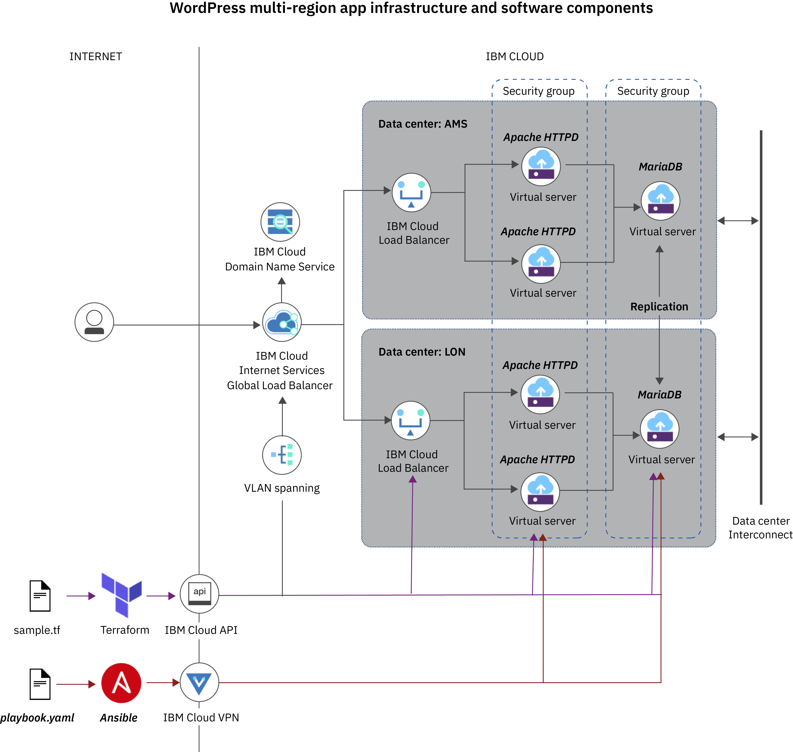

---
copyright:
  years: 2017, 2019
lastupdated: "2019-01-28"
---
{:new_window: target="_blank"}
{:shortdesc: .shortdesc}
{:screen: .screen}
{:pre: .pre}
{:table: .aria-labeledby="caption"}
{:codeblock: .codeblock}
{:tip: .tip}
{:note: .note}
{:important: .important}
{:download: .download} 
 
# Tutorial: Deploying WordPress in a highly available web site architecture across multiple regions with Terraform and Ansible  
{: #multi_region}

Use this tutorial to provision a highly available web site architecture across multiple regions on {{site.data.keyword.Bluemix_notm}} with Terraform. Then, deploy a single instance of WordPress and replicate WordPress across the two regions to explore the security and resiliency features of {{site.data.keyword.Bluemix_notm}} Security Groups, DNS, Web Application Firewall (WAF), global and local load balancers. With this setup, you can create a resilient, secure and scalable web environment with highly available web sites that use custom DNS domain names. In this tutorial, Terraform and Ansible are loosely integrated through the sharing of inventory information.
{: shortdesc}
 
## Solution overview
{: #overview}

The following image shows the infrastructure and software components of the highly available web site architecture that you provision as part of this tutorial. 
The basic web site architecture that is used in [Tutorial: Deploying WordPress on {{site.data.keyword.Bluemix_notm}} infrastructure with Terraform and Ansible](/docs/terraform/tutorials/wordpress_with_terraform_and_ansible.html) is deployed into each {{site.data.keyword.Bluemix_notm}} region. To balance the workload between the two regions, an {{site.data.keyword.Bluemix_notm}} Internet Services Load Balancer with a user specified domain is deployed into your {{site.data.keyword.Bluemix_notm}} account and configured with a health check. The health check performs tests for each region to determine if a region is available to receive network traffic. If one region becomes unavailable due to a network, app, or infrastructure failure, the health check determines this event and stops sending network traffic to the unavailable region.

{{site.data.keyword.Bluemix_notm}} Security Groups extend across regions and are used to secure all Apache web servers and the two Mariadb instances. The security groups provide secure outbound access to the open source repositories for Apache, Mariadb and WordPress. At the same time, the security groups deny all inbound internet traffic except via the {{site.data.keyword.Bluemix_notm}} Load Balancers. To secure your environment, the communication between the WordPress instances and the Mariadb databases is limited to the private network and is allowed on the Mariadb ports only.

The Ansible playbooks install multiple WordPress instances on Apache web servers and set up a replicated Mariadb database on {{site.data.keyword.Bluemix_notm}} Virtual Servers. To keep both Mariadb database instances in sync, a master-master replication between the two regions is set up on the private {{site.data.keyword.Bluemix_notm}} network. 



The following {{site.data.keyword.Bluemix_notm}} resources are provisioned for you as part of this tutorial. 

<table>
<caption>Web app infrastructure and software components</caption>
<thead>
<th>Tool</th>
<th>Resources</th>
</thead>
<tbody>
<tr>
<td>Terraform</td>
<td><ul>
  <li>6 {{site.data.keyword.Bluemix_notm}} Virtual Servers that run CentOS 7.x; 4 {{site.data.keyword.Bluemix_notm}} Virtual Servers are used for the WordPress Apache web servers, 2 are used for the WordPress Mariadb database</li><li>2 {{site.data.keyword.Bluemix_notm}} Security Groups to secure your WordPress Apache web servers and the Mariadb instances</li><li>2 {{site.data.keyword.Bluemix_notm}} CloudInit templates</li><li>2 {{site.data.keyword.Bluemix_notm}} Load Balancers, one load balancer for each data center to balance workload between the WordPress Apache web servers</li><li>1 {{site.data.keyword.Bluemix_notm}} Internet Services Global Load Balancer to connect the two regions</li><li>2 {{site.data.keyword.Bluemix_notm}} Internet Services origin pools</li><li>1 {{site.data.keyword.Bluemix_notm}} Internet Services healthcheck to check if the regions are available to receive workloads</li><li>{{site.data.keyword.Bluemix_notm}} DNS Registration and domain name servers for your custom domain</li><li>1 {{site.data.keyword.Bluemix_notm}} Internet Services DNS record</li><li>1 {{site.data.keyword.Bluemix_notm}} Internet Services Web Application Firewall with DDoS protection</li></ul></td>
</tr>
<tr>
<td>Ansible</td>
<td><ul>
  <li>4 Apache (HTTPd) app servers for your WordPress instances</li>
  <li>4 Wordpress installations</li>
  <li>2 Mariadb database servers for your WordPress database and the database replication</li>
  <li>1 Mariadb master-master database replication to keep the databases in both data centers in sync at all times</li>
  <li>1 WordPress database instance</li>
  <li>Automated Wordpress configuration via CLI</li>
</ul></td>
</tr>
</tbody>
</table>

This tutorial intends to demonstrate the capability of building secure, resilient, highly available and scalable websites on {{site.data.keyword.Bluemix_notm}} infrastructure with cross-region networking. The tutorial does not intend to provide a fully operational WordPress deployment. To run this tutorial, infrastructure costs incur for the virtual servers, load balancers, and the custom DNS domain name. The cost for the DNS domain name is fixed and depends on the domain name that you register and the duration that you request. The costs for your infrastructure resources depend on the number of hours or days that the infrastructure resources are provisioned for you. To cancel the billing for your resources, you must remove your infrastructure resources. 
{: important}

## Objectives
{: #objectives}

In this tutorial, you use Terraform to deploy a highly available {{site.data.keyword.Bluemix_notm}} infrastructure setup that you use to deploy a WordPress sample app across {{site.data.keyword.Bluemix_notm}} regions by using Ansible. In particular, you will:

- Set up your environment and all the software that you need for the highly available WordPress app, including Terraform, the  {{site.data.keyword.Bluemix_notm}} Provider plug-in, and Ansible.
- Provision {{site.data.keyword.Bluemix_notm}} infrastructure components for your WordPress sample app across regions by using Terraform.
- Import infrastructure resource information from Terraform to Ansible. 
- Deploy a sample WordPress app across {{site.data.keyword.Bluemix_notm}} regions on your {{site.data.keyword.Bluemix_notm}} infrastructure with Ansible. 
- Use Ansible to finalize the setup of your WordPress app across both regions. 
- Explore the high availability capabilities of the multi-region Wordpress architecture.  

## Time required
{: #time}

60 minutes

## Audience
{: #audience}

This tutorial is intended for network administrators, software developers and architects, who want to become familiar with {{site.data.keyword.Bluemix_notm}} networking and infrastructure components, learn how to use Terraform and Ansible to automate network configuration, and to deploy web infrastructure and apps on IaaS. 

## Prerequisites
{: #prerequisites}
- If you do not have one, create an {{site.data.keyword.Bluemix_notm}} [Pay-As-You-Go or Subscription {{site.data.keyword.Bluemix_notm}} account ](https://cloud.ibm.com/classic/services/domains). 
- [Set up a VPN connection and SSH authentication](/docs/terraform/ansible/ansible.html#setup_vpn) to access {{site.data.keyword.Bluemix_notm}} infrastructure resources over the private network. 
- If you do not have an existing DNS domain registered with IBM Cloud, register one with the {{site.data.keyword.Bluemix_notm}} Domain Registration service. For more information about how to register a new domain, see [Register a New Domain](/docs/infrastructure/dns/register-new-domain.html#register-a-new-domain). To transfer an existing domain to {{site.data.keyword.Bluemix_notm}}, see [Transfer an Existing Domain to {{site.data.keyword.Bluemix_notm}}](/docs/infrastructure/dns/transfer-existing-domain.html#transfer-an-existing-domain-to-ibm-cloud). 
- If you already completed the [Tutorial: Deploying WordPress on {{site.data.keyword.Bluemix_notm}} infrastructure with Terraform and Ansible](/docs/terraform/tutorials/wordpress_with_terraform_and_ansible.html), you can re-use the Terraform and Ansible installations. Simply remove the old Terraform `tf` configuration files from your Terraform project directory and follow step 1 and 6 in [Lesson 1](#setup_terraform) to copy the new Terraform configuration files into your project directory. Then, follow [Lesson 3](#provision_terraform_infrastructure) to provision the {{site.data.keyword.Bluemix_notm}} infrastructure. After the infrastructure is deployed, follow step 5 in [Lesson 4](#create_ansible_inventory) to update your Ansible infrastructure inventory. To deploy your Wordpress app, continue with [Lesson 5](#install_configure_wordpress) in this tutorial. 

## Lesson 1: Setting up Terraform 
{: #setup_terraform}

To use Terraform to provision {{site.data.keyword.Bluemix_notm}} infrastructure resources, you must install Terraform and the {{site.data.keyword.Bluemix_notm}} Provider plug-in for Terraform. The {{site.data.keyword.Bluemix_notm}} Provider plug-in is aware of all the {{site.data.keyword.Bluemix_notm}} resources that you can provision with Terraform, including the API and the methods to expose these resources in the cloud.
{: shortdesc}

1. Download the {{site.data.keyword.Bluemix_notm}} Terraform Provider.  
   ```
   git clone https://github.com/IBM-Cloud/terraform-provider-ibm.git
   ```
   {: pre}
   
2. Install Terraform on your local machine. 
   1. Create a folder on your local system that is called `terraform` and navigate into your folder. 
      ```
      mkdir terraform && cd terraform
      ```
      {: pre}
      
   2. [Download the Terraform binary to your local machine ](https://www.terraform.io/downloads.html). Select the version that is provided for the operating system that you use on your local machine.
   3. Extract the Terraform package and copy the binary into your `terraform` directory. 
   4. Point the `$PATH` environment variable to your Terraform binary.
      ```
      export PATH=$PATH:$HOME/terraform
      ```
      {: pre}
      
   5. Verify that the installation is successful by using a `terraform` command.
      ```
      terraform
      ```
      {: pre}
      
      Example output: 
      ```
      Usage: terraform [-version] [-help] <command> [args]
      The available commands for execution are listed below.
      The most common, useful commands are shown first, followed by less common or more advanced commands. If you're just getting started with Terraform, stick with the common commands. For the other commands, please read the help and docs before usage.
      Common commands:
          apply              Builds or changes infrastructure
          console            Interactive console for Terraform interpolations
          destroy            Destroy Terraform-managed infrastructure
          env                Workspace management
          fmt                Rewrites config files to canonical format
          get                Download and install modules for the configuration
          graph              Create a visual graph of Terraform resources
          import             Import existing infrastructure into Terraform
          init               Initialize a Terraform working directory
          output             Read an output from a state file
          plan               Generate and show an execution plan
          providers          Prints a tree of the providers used in the configuration
          push               Upload this Terraform module to Atlas to run
          refresh            Update local state file against real resources
          show               Inspect Terraform state or plan
          taint              Manually mark a resource for recreation
          untaint            Manually unmark a resource as tainted
          validate           Validates the Terraform files
          version            Prints the Terraform version
          workspace          Workspace management
      All other commands:
          debug              Debug output management (experimental)
          force-unlock       Manually unlock the terraform state
          state              Advanced state management
      ```
      {: screen}  
      
3. Install the {{site.data.keyword.Bluemix_notm}} Provider plug-in for Terraform. 
   1. [Download the latest version of the {{site.data.keyword.Bluemix_notm}} Provider binary ](https://github.com/IBM-Cloud/terraform-provider-ibm/releases). 
   2. Create a hidden folder for your plug-in. The {{site.data.keyword.Bluemix_notm}} Provider plug-in is used only by the Terraform CLI and is not meant to be accessed by the user.  
      ```
      mkdir $HOME/.terraform.d/plugins
      ```
      {: pre}
      
   3. Move the {{site.data.keyword.Bluemix_notm}} Provider plug-in into your hidden folder. 
      ```
      mv $HOME/Downloads/terraform-provider-ibm* $HOME/.terraform.d/plugins/
      ```
      {: pre}
      
   4. Navigate into your hidden directory and verify that the installation is complete. 
      ```
      cd $HOME/.terraform.d/plugins && ./terraform-provider-ibm_*
      ```
      {: pre}
      
      Example output: 
      ```
      2018/09/25 17:30:14 {{site.data.keyword.Bluemix_notm}} Provider version 0.11.3  fdc4aa0f0547177f3ea8b14c7a58a849e240f64a
      This binary is a plugin. These are not meant to be executed directly.
      Please execute the program that consumes these plugins, which will load any plugins automatically
      ```
      {: screen}
      
4. Create an {{site.data.keyword.Bluemix_notm}} platform API key. Note the **API Key** that is created for you. The API key has the same permissions and {{site.data.keyword.Bluemix_notm}} IAM roles as your user ID. 
   ```
   ibmcloud iam api-key-create <apikey_name>
   ```
   {: pre}
   
   Example output: 
   ```
   Creating API key mykey as user@company.com...
   OK
   API key mykey was created
   Please preserve the API key! It cannot be retrieved after it's created.
                 
   Name          mykey   
   Description      
   Created At    2018-09-27T20:22+0000   
   API Key       a1BcdEfghIJkLmNopqrSTUV45W-ABC12DefGH3ij2klm   
   Locked        false   
   UUID          ApiKey-1a2v3c45-ab1c-1a2b-1234-a123b456712
   ```
   {: screen}
   
   Your API key is displayed in the **API Key** section of your CLI output. 
      
5. Retrieve your {{site.data.keyword.Bluemix_notm}} infrastructure user name and API key. 
   1. Log in to the [{{site.data.keyword.Bluemix_notm}} infrastructure portal ](https://cloud.ibm.com/classic).
   2. From the menu , select **Infrastructure**.
   3. From the menu bar, select **Account** > **Users** > **User List**.
   4. Find the user whose user name and API key you want to retrieve. 
   5. Click **Generate** to generate an API key or **View** to view your existing API key. A pop-up window opens that shows the infrastructure user name and API key. 
5. Copy the Terraform configuration files to create your WordPress infrastructure from the {{site.data.keyword.Bluemix_notm}} Terraform Provider package to your Terraform project directory. 
  1. Copy the Terraform configuration files to create your WordPress infrastructure from the {{site.data.keyword.Bluemix_notm}} Terraform Provider package.
   ```
   mv /terraform-provider-ibm/examples/ibm-website-multi-region/* <terraform_project_path>
   ```
   {: pre}
  
6. Configure the {{site.data.keyword.Bluemix_notm}} Provider plug-in. 
   1. Navigate into your Terraform project directory and 
      ```
      cd <terraform_project_path> && nano terraform.tfvars
      ```
      {: pre}
      
   2. Add your infrastructure credentials and the {{site.data.keyword.Bluemix_notm}} API key to the `terraform.tfvars` file. 
      ```
      softlayer_username = "<infrastructure_username>"
      softlayer_api_key = "<infrastructure_api_key>"
      bluemix_api_key = "<ibmcloud_api_key>"
      ```
      {: codeblock}
      
With your Terraform project directory set up, you can continue to set up your [Ansible work environment](#setup_ansible). 

## Lesson 2: Setting up Ansible
{: #setup_ansible}
Set up your Ansible project directory and install Ansible on your local machine to automate the deployment of WordPress on your Terraform-deployed infrastructure. 
{: shortdesc}
1. On the same level as your Terraform project directory, create an Ansible project directory and navigate into the directory. 
   ```
   mkdir ansible && cd ansible
   ```
   {: pre}
   
2. Copy the Ansible playbooks and configuration files to create your WordPress app from the `examples` folder of the {{site.data.keyword.Bluemix_notm}} Terraform Provider package to your Ansible project directory. 
   ```
   mv terraform-provider-ibm/examples/ansible/ibm_ansible_wordpress/* <ansible_project_path>
   ```
   {: pre}
   
3. Install Ansible on your local machine. 
   1. Install [Python version 3.6 or later](https://www.python.org/downloads/). 
   2. Install the Python package manager `pip`. Use the same version that you used when you installed Python. The following example assumes that you downloaded Python version 3.6 and want to install pip version 3.6. 
      ```
      python3.6 -m pip install 3.6
      ```
      {: pre}
   3. Install Ansible on your local machine. 
      ```
      sudo pip install ansible
      ```
      {: pre}
   
   4. Verify that Ansible is installed on your machine. 
      ```
      ansible --version
      ```
      {: pre}
   
      Example output: 
      ```
      ansible 2.7.0
      config file = None
      configured module search path = ['/Users/user/.ansible/plugins/modules', '/usr/share/ansible/plugins/modules']
      ansible python module location = /Library/Frameworks/Python.framework/Versions/3.6/lib/python3.6/site-packages/ansible
      executable location = /Library/Frameworks/Python.framework/Versions/3.6/bin/ansible
      python version = 3.6.6 (v3.6.6:4cf1f54eb7, Jun 26 2018, 19:50:54) [GCC 4.2.1 Compatible Apple LLVM 6.0 (clang-600.0.57)]
      ```
      {: screen}
4. If you run macOS on your local machine, securely store your local machine password with Ansible Vault in a `vault.yml` file. The WordPress sample playbook package requires `sudo` permissions to execute updates to the host file and to install modules to monitor the state of the app. Your local machine password is stored as the encrypted variable `su_password` by Ansible Vault in the `vault.yml` file in the `group_vars/control` folder of your Ansible project directory. If you use a Linux distribution, this step is not required. 
   1. Create your `vault.yml` file. 
      ```
      ansible-vault create <ansible_project_path>/group_vars/control/vault.yml
      ```
      {: pre}
   2. Enter a password to protect your `vault.yml` file. Ansible Vault requires you to protect this file before you can work with your file. After you enter a password, Ansible Vault opens the editor that is stored in the `$EDITOR` environment variable. If this environment variable is not set, the `vi` editor is opened by default so that you can edit the file. 
   3. Add the `su_password` variable to your file and set the variable to your local machine password. 
      ```
      su_password: <password>
      ```
      {: pre}
 
   4. Save your changes and exit the editor. 
   5. To allow Ansible to decrypt the `vault.yml` file, store the password that you used to protect your `vault.yml` file in a `vault_pass.txt` file in your user home directory. The user home directory is defined in the `ansible.cfg` file as the default location to find the password. 
      ```
      echo "<vault_file_password>" > ~/vault_pass.txt
      ```
   
Great! Now that you completed the setup of Terraform and Ansible, you can start [provisioning the WordPress infrastructure](#provision_terraform_infrastructure) in {{site.data.keyword.Bluemix_notm}} by using Terraform. 
   
## Lesson 3: Provisioning the Wordpress infrastructure with Terraform
{: #provision_terraform_infrastructure}
In this lesson, you deploy the virtual server instances, the {{site.data.keyword.Bluemix_notm}} load balancers, an {{site.data.keyword.Bluemix_notm}} Internet Services instance, a global load balancer and origin pools that you need for your WordPress app. 
{: shortdesc}
1. In your Terraform project directory, update the `variables.tf` file. 
   1. Navigate into your Terraform project directory and edit the `variables.tf` file.
      ```
      cd <terraform_project_path> && nano variables.tf
      ```
      {: pre}
  2. Update the variable `domain` with the DNS domain that you registered earlier.    
      ```
      domain = "<example.com>"
      ```
      {: codeblock}   
  3. Specify the data centers where you want to deploy your resources. Make sure that these data centers belong to different {{site.data.keyword.Bluemix_notm}} regions. 
      ```
      variable datacenter1 {
        default = "<datacenter1>"
      }
      variable datacenter2 {
        default = "<datacenter2>"
      }
      ```
      {: codeblock} 
  4.  Enter an SSH label and the public SSH key that you created as part of the prerequisites in this tutorial.
      ```
      variable ssh_label {
        description = "ssh label"
        default     = "CloudSSHKey"
      }

      variable ssh_key {
        description = "ssh public key"
        default     = "<public_ssh_key>"
      }
      ```
      {: codeblock}
      
2. Review the content of the Terraform `tf` files. The resources that are deployed in this tutorial are spread across a number of files depending on the function that they perform. You can find the {{site.data.keyword.Bluemix_notm}} Internet Services resources in the `dns.tf` file. Information about {{site.data.keyword.Bluemix_notm}} Security Groups are found in the `network.tf` file and the {{site.data.keyword.Bluemix_notm}} Virtual Server and CloudInit resources are included in the `main.tf`file. For more information about each resource and the resource configuration, see the [{{site.data.keyword.Bluemix_notm}} Provider documentation](https://ibm-cloud.github.io/tf-ibm-docs/).

3. Deploy the {{site.data.keyword.Bluemix_notm}} infrastructure. 
   1. Instruct Terraform to deploy the infrastructure. Terraform parses the configuration files, creates an execution plan, and lists a summary of the resources that must be created. 
      ```
      terraform apply
      ```
      {: pre} 
   
      Example output: 
      ```
      data.template_cloudinit_config.db_userdata: Refreshing state...
      data.template_cloudinit_config.app_userdata: Refreshing state...
      An execution plan has been generated and is shown below.
      Resource actions are indicated with the following symbols:
        + create
      Terraform will perform the following actions:
        + ibm_compute_ssh_key.ssh_key
 
        + ibm_compute_vm_instance.app1[0]
      ....
      Plan: 34 to add, 0 to change, 0 to destroy.
      Do you want to perform these actions?
        Terraform will perform the actions described above.
        Only 'yes' will be accepted to approve.
        Enter a value: 
      ```
      {: screen}
      
   2. Confirm the creation of the infrastructure resources by entering **yes**. The creation of all resources might take a few minutes to complete. 
   
   3. Wait for the infrastructure to be fully provisioned. 
     
      Example output: 
      ```
      Apply complete! Resources: 34 added, 0 changed, 0 destroyed.
      web_dns_name = wcpclouduk.com
      ```
      {: screen}
      
   4. In your CLI output, find and note the **web_dns_name** that is assigned to the {{site.data.keyword.Bluemix_notm}} Internet Services Global Load Balancer.
         
4. Verify that you can access one of the {{site.data.keyword.Bluemix_notm}} Virtual Server instances behind the {{site.data.keyword.Bluemix_notm}} Load Balancers that are deployed in each region. To test access via the load balancers, Terraform deploys a sample Apache web server on the {{site.data.keyword.Bluemix_notm}} Virtual Server instances by using CloudInit. This Apache web server is accessible by using the **web_dns_name** that is assigned to the {{site.data.keyword.Bluemix_notm}} Internet Services Global Load Balancer in the previous step.
   ```
   curl <web_dns_name>
   ```
   {: pre}
   
   Example output: 
   ```
   <!DOCTYPE html PUBLIC "-//W3C//DTD XHTML 1.1//EN" "http://www.w3.org/TR/xhtml11/DTD/xhtml11.dtd"><html><head>
        <meta http-equiv="content-type" content="text/html; charset=UTF-8">
        <title>Apache HTTP Server Test Page powered by CentOS</title>
        <meta http-equiv="Content-Type" content="text/html; charset=UTF-8">
   ```
   {: screen}
   
## Lesson 4: Creating an Ansible infrastructure inventory
{: #create_ansible_inventory}

Use the {{site.data.keyword.Bluemix_notm}} Terraform inventory script to import infrastructure information from your Terraform `terraform.tfstate` file into Ansible. 
{: shortdesc}
1. In your existing Ansible project directory, create a directory that is named `inventory`.
   ```
   mkdir inventory
   ```
   {: pre}
   
2. Copy the `terraform_inv.py` and the `terraform_inv.ini` files from the {{site.data.keyword.Bluemix_notm}} Terraform provider `examples/ansible/ibm_ansible_dyn_inv` folder into the `inventory` directory that you created. 
   ```
   mv terraform-provider-ibm/examples/ansible/ibm_ansible_dyn_inv/terraform_inv.* <ansible_project_path>/inventory/
   ```
   {: pre}
3. Create an empty `hosts` file in your `inventory` directory. 
   ```
   touch hosts
   ```
   {: pre}
      
4. Specify the location of the `terraform.tfstate` file that was created after you provisioned the {{site.data.keyword.Bluemix_notm}} infrastructure with Terraform in Lesson 3. The `terraform.tfstate` file is the source for information about the deployed infrastructure that you want to target with Ansible. By specifying the location of the file in a `terraform_inv.ini` file and storing it in the same directory as the {{site.data.keyword.Bluemix_notm}} Terraform inventory script, Ansible can import the Terraform infrastructure information directly.
   1. In your Ansible `inventory` directory, open the `terraform_inv.ini` file. 
      ```
      nano terraform_inv.ini
      ```
      {: pre}
      
   2. Add the fully qualified path to the `terraform.tfstate` file that holds your Terraform infrastructure information.   
      ```
      [TFSTATE] 
      TFSTATE_FILE = <terraform_project_path>/terraform.tfstate
      ```
      {: codeblock}
   
5. Verify that the {{site.data.keyword.Bluemix_notm}} Terraform inventory script can import the Terraform infrastructure that is defined in the `terraform.tfstate` file. 
   1. Navigate to your Ansible project parent directory.  
   2. Import the Terraform infrastructure information from the `terraform.tfstate` file to create the Ansible infrastructure inventory. 
      ```
      ansible-inventory -i ./inventory --list
      ```
      {: pre}

## Lesson 5: Installing and configuring WordPress with Ansible
{: #install_configure_wordpress}

Set up WordPress on the Terraform-provided {{site.data.keyword.Bluemix_notm}} infrastructure by using Ansible. 
{: shortdesc}

1. Install WordPress. The installation of WordPress can take up to 10 minutes. 
   ``` 
   ansible-playbook -i inventory site.yml
   ```
   {: pre}
   
   Example output: 
   ```
   TASK [MySQL Change Master Status] **********************************
   changed: [db01]
   changed: [db02]
   
   PLAY RECAP *********************************************************
   app101     : ok=26   changed=15  unreachable=0   failed=0
   app102     : ok=26   changed=15  unreachable=0   failed=0
   app201     : ok=26   changed=15  unreachable=0   failed=0
   app202     : ok=26   changed=15  unreachable=0   failed=0
   control    : ok=5    changed=1   unreachable=0   failed=0
   db101      : ok=30   changed=16  unreachable=0   failed=0
   db102      : ok=30   changed=16  unreachable=0   failed=0
   ```
   {: screen}
   
   If errors occur during the WordPress installation, you can correct the errors that are reported by Ansible and rerun the Ansible playbook again. Ansible playbooks are idempotent and can be executed multiple times. When you execute a playbook multiple times, only changes that bring the environment to the desired state are executed.
   {: tip}
   
2. Open WordPress. After the initial installation, WordPress is not accessible via the {{site.data.keyword.Bluemix_notm}} Internet Services Global Load Balancer. When you try to access WordPress after the initial installation, a 503 Service unavailable HTTP response code is returned from the {{site.data.keyword.Bluemix_notm}} Load Balancers that are deployed in each region. This behavior is expected. After the installation, WordPress forces the user who administers WordPress to set up the app by redirecting the user to the WordPress configuration dialog with a 302 Temporary redirect HTTP response code. The {{site.data.keyword.Bluemix_notm}} Load Balancers in each region do not allow to customize the list of valid HTTP response codes and do not recognize a 302 HTTP response code as a healthy response code. As a consequence, the {{site.data.keyword.Bluemix_notm}} Internet Services Global Load Balancer returns the 503 HTTP response code to the user.
   ```
   curl http://app101 -vS
   ```
   {: pre}
   
   Example output: 
   ```
   * Rebuild URL to: app101/
   *   Trying 10.72.58.86
   * TCP_NODELAY set
   * Connected to app101 (10.72.58.86) port 80 (#0)
   > GET / HTTP/1.1
   > Host: app101
   > User-Agent: curl/7.54.0
   > Accept: */*
   >
   < HTTP/1.1 302 Found
   < Date: Fri, 02 Nov 2018 15:53:02 GMT
   < Server: Apache
   < X-Powered-By: PHP/5.4.16
   < Expires: Wed, 11 Jan 2019 05:00:00 GMT
   < Cache-Control: no-cache, must-revalidate, max-age=0
   < Location: http://app101/wp-admin/install.php
   < Content-Length: 0
   < Content-Type: test/html; charset=UTF-8
   <
   * Connection #0 to host app101 left intact
   ```
   {: screen}
    
3. Complete the WordPress setup dialog by using Ansible and the WordPress CLI. During the setup, you provide the user details of the WordPress admin that you want to use and configure the WordPress database. 

   If you prefer to manually set up WordPress, you can access the WordPress site via the {{site.data.keyword.Bluemix_notm}} internal address `http://app101` from a web browser and complete the initial setup dialog. After you complete the setup, log in as the WordPress admin user. Go to **Settings** and enter the **web_dns_name** of the {{site.data.keyword.Bluemix_notm}} Internet Services Global Load Balancer in the **WordPress Address (URL)** and **Site Address (URL)** fields in the format `http://<web_dns_name>`. Then, click **Save**. 
   {: tip}
   
   1. Open the `wp_site_setup.yaml` file. 
      ```
      nano wp_site_setup.yaml
      ```
      {: pre}
   
   2. Enter the user name, password, and email address of the WordPress admin user that you want to use. You can also use the default values that are already provided in the file.   
      ```
      ...
        site_admin: "<username>"
        site_email: "<email>"
        site_password: "<password>"
      ...
      ```
      {: codeblock}
      
   3. Run the `wp_site_setup.yaml` Ansible playbook to complete the inital setup dialog by using the WordPress CLI. During the setup, Ansible programatically retrieves the **web_dns_name** of the {{site.data.keyword.Bluemix_notm}} Internet Services Global Load Balancer using the Terraform inventory integration and uses the domain name to configure the WordPress site. 
      ```
      ansible-playbook -i inventory wp_site_setup.yml
      ```
      {: pre}
      
      Example output: 
      ```
      TASK [debug] ****************************************************************
      ok: [app102] => {
           "msg": [
               "Wordpress URL is wcpclouduk.com",
               "Wordpress admin user is: admin and password is: strong@password
             ]
          }
      PLAY RECAP ******************************************************************
      app102    : ok=5  changed=2   unreachable=0   failed=0
      ```
      {: screen}
   
4. Access your WordPress site from your preferred browser via the **web_dns_address** of the {{site.data.keyword.Bluemix_notm}} Internet Services Global Load Balancer. The **web_dns_address** is returned as the **Wordpress URL** in the CLI output of the previous step. 
   ```
   http://<web-dns-address>
   ```
   {: codeblock}
   
5. Check the status of your website. 
   ```
   ansible-playbook -i inventory stack_status.yml
   ```
   {: pre}
6. Optional: Restart your website. 
   ```
   ansible-playbook -i inventory stack_restart.yml
   ```
   {: pre}   

## Lesson 6: Explore the high availability features of {{site.data.keyword.Bluemix_notm}} 
{: #verify_resilience}

With your WordPress app up and running, you can now experiment what happens if one or more {{site.data.keyword.Bluemix_notm}} Virtual Server instances become unavailable. 
{: shortdesc}

1. Shutdown one {{site.data.keyword.Bluemix_notm}} Virtual Server instance where WordPress is deployed and observe the status change of the  {{site.data.keyword.Bluemix_notm}} Load Balancers and the availability of the web site. 
   1. Open the [Infrastructure console](https://cloud.ibm.com/classic/devices). 
   2. Select **Devices** > **Device List**. A list of your {{site.data.keyword.Bluemix_notm}} Virtual Server instances is shown. 
   3. Find the `app101` {{site.data.keyword.Bluemix_notm}} Virtual Server instance and select **Power On/Off** from the **Actions** menu.
    
2. Check the health of your {{site.data.keyword.Bluemix_notm}} Load Balancers.
   1. Open the [status page](https://cloud.ibm.com/classic/network/loadbalancing/cloud) of your {{site.data.keyword.Bluemix_notm}} Load Balancers and verify that both load balancers are listed as `online`. 
   2. Select the {{site.data.keyword.Bluemix_notm}} Load Balancer that is deployed in the same region as the `app101` {{site.data.keyword.Bluemix_notm}} Virtual Server that you shut down. The **Server Status** shows `1/2 Healthy` in the **Health Status**, which reflects that one of your {{site.data.keyword.Bluemix_notm}} Virtual Server instances is available, and the other one is not.  
    
3. Check the health of your {{site.data.keyword.Bluemix_notm}} Internet Services Global Load Balancer.   
   1. From the [{{site.data.keyword.Bluemix_notm}} resource list](https://cloud.ibm.com/resources), select your **Internet Services** instance. 
   2. Select **Reliability** > **Global Load Balancers** to navigate to the status page for your {{site.data.keyword.Bluemix_notm}} Internet Services Global Load Balancer. 
   3. Verify that your {{site.data.keyword.Bluemix_notm}} Internet Services Global Load Balancer shows a `Healthy` health status. 
   
4. Access WordPress with your preferred web browser and verify that your web site is available and shows the splash screen. 
   ```
   http://<web-dns-address>
   ```
   {: codeblock}
   
5. Shutdown a second {{site.data.keyword.Bluemix_notm}} Virtual Server instance where WordPress is deployed and observe the status change of the {{site.data.keyword.Bluemix_notm}} Load Balancers and the availability of the web site.
   1. From the [Infrastructure console](https://cloud.ibm.com/classic/devices), select **Devices** > **Device List**. A list of your {{site.data.keyword.Bluemix_notm}} Virtual Server instances is shown. 
   3. Find the `app102` {{site.data.keyword.Bluemix_notm}} Virtual Server instance and select **Power On/Off** from the **Actions** menu.

6. Check the health of your {{site.data.keyword.Bluemix_notm}} Load Balancers.
   1. Open the [status page](https://cloud.ibm.com/classic/network/loadbalancing/cloud) of your {{site.data.keyword.Bluemix_notm}} Load Balancers and select the {{site.data.keyword.Bluemix_notm}} Load Balancer that is deployed in the same region as the `app101` and `app102` {{site.data.keyword.Bluemix_notm}} Virtual Servers that you shut down. 
   2. Verify that the **Server Status** shows `0/2 Healthy` in the **Health Status**, which reflects that all of your {{site.data.keyword.Bluemix_notm}} Virtual Servers are unavailable. 
      
7. Check the health of your {{site.data.keyword.Bluemix_notm}} Internet Services Global Load Balancer.   
   1. From the [{{site.data.keyword.Bluemix_notm}} resource list](https://cloud.ibm.com/resources), select your **Internet Services** instance. 
   2. Select **Reliability** > **Global Load Balancers** to navigate to the status page for your {{site.data.keyword.Bluemix_notm}} Internet Services Global Load Balancer. 
   3. Verify that your {{site.data.keyword.Bluemix_notm}} Internet Services Global Load Balancer shows a `Degraded` health status. The `Degraded` status is displayed because only the origin pool in the second data center is still in a healthy state. 
   
8. Access WordPress with your preferred web browser and verify that your web site is still available and shows the splash screen. 
   ```
   http://<web-dns-address>
   ```
   {: codeblock}  

9. Shutdown the {{site.data.keyword.Bluemix_notm}} Virtual Server instance in the second data center where MariaDB is deployed and observe the status change of the {{site.data.keyword.Bluemix_notm}} Load Balancers and the availability of the web site. 
   1. From the [Infrastructure console](https://cloud.ibm.com/classic/devices), select **Devices** > **Device List**. A list of your {{site.data.keyword.Bluemix_notm}} Virtual Server instances is shown. 
   3. Find the `db201` {{site.data.keyword.Bluemix_notm}} Virtual Server instance and select **Power On/Off** from the **Actions** menu.

10. Check the health of your {{site.data.keyword.Bluemix_notm}} Load Balancers.
    1. Open the [status page](https://cloud.ibm.com/classic/network/loadbalancing/cloud) of your {{site.data.keyword.Bluemix_notm}} Load Balancers and open one of the {{site.data.keyword.Bluemix_notm}} Load Balancers. 
    2. Verify that the **Server Status** shows `0/2 Healthy` in the **Health Status**, which reflects that all of your {{site.data.keyword.Bluemix_notm}} Virtual Servers are unavailable. 
    3. Open the other {{site.data.keyword.Bluemix_notm}} Load Balancers that is deployed in the other data center. 
    4. Verify that the **Server Status** also shows `0/2 Healthy` in the **Health Status**. When the MariaDB database becomes unavailable, all WordPress app instances become unavailable immediately. 
      
11. Check the health of your {{site.data.keyword.Bluemix_notm}} Internet Services Global Load Balancer.   
    1. From the [{{site.data.keyword.Bluemix_notm}} resource list](https://cloud.ibm.com/resources), select your **Internet Services** instance. 
    2. Select **Reliability** > **Global Load Balancers** to navigate to the status page for your {{site.data.keyword.Bluemix_notm}} Internet Services Global Load Balancer. 
    3. Verify that your {{site.data.keyword.Bluemix_notm}} Internet Services Global Load Balancer shows a `Critical` health status. The `Critical` status is displayed because all WordPress app instances are unavailable.  

12. Access WordPress with your preferred web browser and verify that your web site is not accessible anymore. Your web browser displays a **503 Service Unavailable** HTTP response because both WordPress web servers in one data center are down and the MariaDB database in the other data center is down.   
    ```
    http://<web-dns-address>
    ```
    {: codeblock}  
    
13. Restart your {{site.data.keyword.Bluemix_notm}} Virtual Server instances. 
    1. From the [Infrastructure console](https://cloud.ibm.com/classic/devices), select **Devices** > **Device List**. A list of your {{site.data.keyword.Bluemix_notm}} Virtual Server instances is shown. 
   3. Find the `db201`, `app101`, and `app102` {{site.data.keyword.Bluemix_notm}} Virtual Server instances and select **Power On/Off** from the **Actions** menu to power on your instances again. You can choose any order to power on your instances. 
   
14. Check the health of your {{site.data.keyword.Bluemix_notm}} Load Balancers.
    1. Open the [status page](https://cloud.ibm.com/classic/network/loadbalancing/cloud) of your {{site.data.keyword.Bluemix_notm}} Load Balancers and open one of the {{site.data.keyword.Bluemix_notm}} Load Balancers. 
    2. Verify that the **Server Status** shows `2/2 Healthy` in the **Health Status**, which reflects that all of your {{site.data.keyword.Bluemix_notm}} Virtual Servers in this data center are available. 
    3. Open the other {{site.data.keyword.Bluemix_notm}} Load Balancers that is deployed in the other data center. 
    4. Verify that the **Server Status** also shows `2/2 Healthy` in the **Health Status**, which reflects that all of your {{site.data.keyword.Bluemix_notm}} Virtual Servers in the second data center are available. 
    
15. Check the health of your {{site.data.keyword.Bluemix_notm}} Internet Services Global Load Balancer.   
    1. From the [{{site.data.keyword.Bluemix_notm}} resource list](https://cloud.ibm.com/resources), select your **Internet Services** instance. 
    2. Select **Reliability** > **Global Load Balancers** to navigate to the status page for your {{site.data.keyword.Bluemix_notm}} Internet Services Global Load Balancer. 
    3. Verify that your {{site.data.keyword.Bluemix_notm}} Internet Services Global Load Balancer shows a `Healthy` health status. It might take a few minutes to show a `Healthy` status because of the policies that are defined in the health check. 
    
16. Access WordPress with your preferred web browser and verify that your web site is available again and shows the splash screen. 
    ```
    http://<web-dns-address>
    ```
    {: codeblock}  

    
Great! You successfully installed and configured a highly available instance of WordPress by using Ansible and Terraform. Now you can start architecting and deploying resilient and scalable web sites with {{site.data.keyword.Bluemix_notm}}. Continue to explore WordPress by reviewing the [First steps with WordPress tutorial ](https://codex.wordpress.org/First_Steps_With_WordPress). You can also research how to deploy any of the other widely available open source web site solutions on {site.data.keyword.Bluemix_notm}}.
