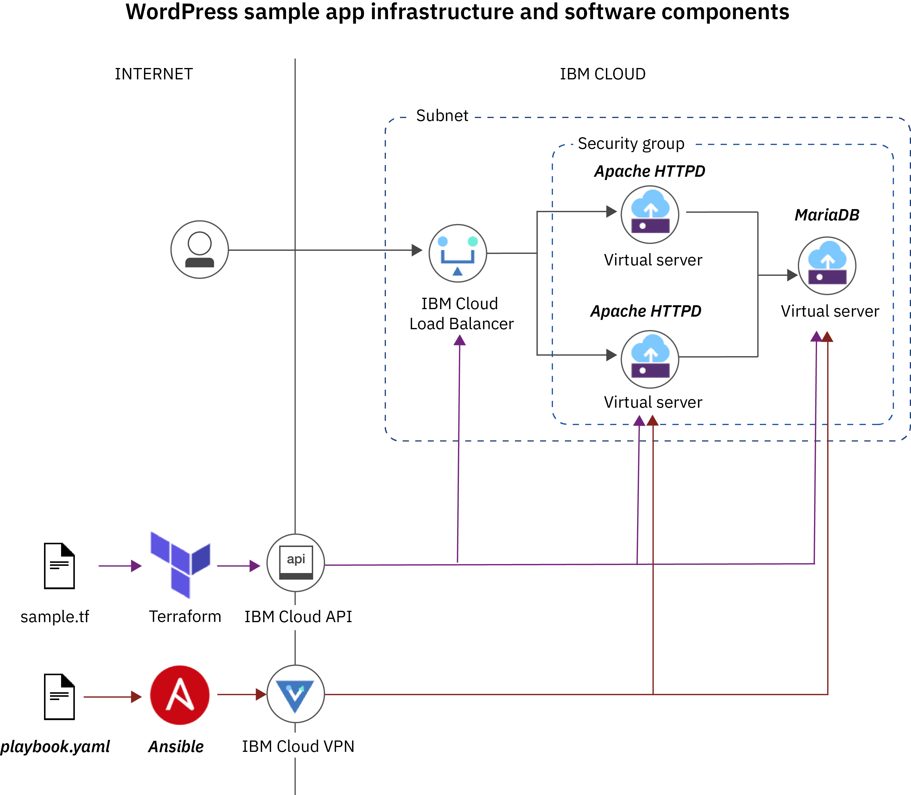

---

copyright:
  years: 2017, 2018
lastupdated: "2018-11-14"

---

{:new_window: target="_blank"}
{:shortdesc: .shortdesc}
{:screen: .screen}
{:pre: .pre}
{:table: .aria-labeledby="caption"}
{:codeblock: .codeblock}
{:tip: .tip}
{:note: .note}
{:important: .important}
{:download: .download}

# Tutorial: Deploying WordPress on IBM Cloud infrastructure with Terraform and Ansible
{: #deploy_wordpress}

Use this tutorial to automate the provisioning of infrastructure resources in {{site.data.keyword.Bluemix_notm}} by using Terraform and the deployment of WordPress on those resources with Ansible.  
{: shortdesc}

[Ansible](https://docs.ansible.com) and Terraform are complimentary solutions, each address a key area of app and environment management. Terraform provides lifecycle management of infrastructure whereas Ansible helps you to provision and configure apps. This tutorial shows how you provision {{site.data.keyword.Bluemix_notm}} infrastructure with Terraform and then use Ansible to deploy Wordpress on Apache web servers and Mariadb, on your Terraform-deployed infrastructure resources. Terraform and Ansible are loosely integrated through the sharing of inventory information.

## Solution overview
{: #overview}

The following image shows the infrastructure and software components that you provision as part of this tutorial. 



For the WordPress sample app, the Ansible playbooks package implements a single site deployment of multiple Apache web servers with a single Mariadb database host that run on {{site.data.keyword.Bluemix_notm}} virtual servers. The private IP addresses of the Apache web servers are added to the {{site.data.keyword.Bluemix_notm}} Load Balancer (CLB) that serves as the public endpoint for your WordPress deployment. 

Terraform infrastructure components are provisioned by using Terraform configuration files whereas Ansible uses playbooks to automate the deployment of software components. 

<table>
<caption>Wordpress sample app infrastructure and software components</caption>
<thead>
<th>Tool</th>
<th>Resources</th>
</thead>
<tbody>
<tr>
<td>Terraform</td>
<td><ul><li>Three {{site.data.keyword.Bluemix_notm}} virtual servers that run Centos 7.x</li><li>One {{site.data.keyword.Bluemix_notm}} load balancer</li></ul></td>
</tr>
<tr>
<td>Ansible</td>
<td><ul><li>Two Apache (HTTPd) app servers</li><li>One Mariadb</li><li>WordPress</li></ul></td>
</tr>
</tbody>
</table>

This tutorial intends to demonstrate the capability of building websites on {{site.data.keyword.Bluemix_notm}} infrastructure with secure networking, and does not intend to provide a fully operational Wordpress deployment. To run this tutorial, the infrastructure costs that incur are restricted to the virtual servers and the load balancer that are provisioned as part of this tutorial. No costs are required for DNS domain names or SSL/TLS certificates. All infrastructure resources are provisioned with an hourly billing type. The actual costs for you depend on the type of virtual server that you provision and the number of hours that you use your infrastructure resources. As a result of limiting the costs for this tutorial, the website in WordPress is not configured with HTTPS security.
{: important}

## Objectives
{: #objectives}

In this tutorial, you use Terraform to deploy {{site.data.keyword.Bluemix_notm}} infrastructure components that you use to set up a WordPress sample app by using Ansible. In particular, you will:

- Set up your environment and all the software that you need for your sample WordPress app, such as Terraform, {{site.data.keyword.Bluemix_notm}} Provider plug-in, and Ansible.
- Provision {{site.data.keyword.Bluemix_notm}} infrastructure components for your WordPress sample app by using Terraform.
- Import infrastructure resource information from Terraform to Ansible. 
- Deploy a sample WordPress app on your {{site.data.keyword.Bluemix_notm}} infrastructure with Ansible. 
- Use Ansible to finalize the setup of your WordPress app. 

## Time required
{: #time}

60 minutes

## Audience
{: #audience}

This tutorial is intended for network administrators and software developers who want to learn how to use Terraform and Ansible to automate infrastructure and app deployment in {{site.data.keyword.Bluemix_notm}}.

## Prerequisites
{: #prerequisites}

- If you do not have one, create an {{site.data.keyword.Bluemix_notm}} [Pay-As-You-Go or Subscription {{site.data.keyword.Bluemix_notm}} account ](https://console.bluemix.net/registration/). 
- [Set up a VPN connection and SSH authentication](../ansible/ansible.html#setup_VPN) to access {{site.data.keyword.Bluemix_notm}} infrastructure resources over the private network. 

## Lesson 1: Setting up Terraform 
{: #setup_terraform}

To use Terraform to provision {{site.data.keyword.Bluemix_notm}} infrastructure resources, you must install Terraform and the {{site.data.keyword.Bluemix_notm}} Provider plug-in for Terraform. The {{site.data.keyword.Bluemix_notm}} Provider plug-in is aware of all the {{site.data.keyword.Bluemix_notm}} resources that you can provision with Terraform, including the API and the methods to expose these resources in the cloud.
{: shortdesc}

1. Download the {{site.data.keyword.Bluemix_notm}} Terraform Provider project. 
   ```
   git clone https://github.com/IBM-Cloud/terraform-provider-ibm.git
   ```
   {: pre}

2. Install Terraform on your local machine. 
   1. Create a folder on your local system that is called `terraform` and navigate into your folder. 
      ```
      mkdir terraform && cd terraform
      ```
      {: pre}

   2. [Download the Terraform binary to your local machine ](https://www.terraform.io/downloads.html). Select the version that is provided for the operating system that you use on your local machine.
   3. Extract the Terraform package and copy the binary into your `terraform` directory. 
   4. Point the `$PATH` environment variable to your Terraform binary.
      ```
      export PATH=$PATH:$HOME/terraform
      ```
      {: pre}
      
   5. Verify that the installation is successful by using a `terraform` command.
      ```
      terraform
      ```
      {: pre}
      
      Example output: 
      ```
      Usage: terraform [-version] [-help] <command> [args]

      The available commands for execution are listed below.
      The most common, useful commands are shown first, followed by less common or more advanced commands. If you're just getting started with Terraform, stick with the common commands. For the other commands, please read the help and docs before usage.

      Common commands:
          apply              Builds or changes infrastructure
          console            Interactive console for Terraform interpolations
          destroy            Destroy Terraform-managed infrastructure
          env                Workspace management
          fmt                Rewrites config files to canonical format
          get                Download and install modules for the configuration
          graph              Create a visual graph of Terraform resources
          import             Import existing infrastructure into Terraform
          init               Initialize a Terraform working directory
          output             Read an output from a state file
          plan               Generate and show an execution plan
          providers          Prints a tree of the providers used in the configuration
          push               Upload this Terraform module to Atlas to run
          refresh            Update local state file against real resources
          show               Inspect Terraform state or plan
          taint              Manually mark a resource for recreation
          untaint            Manually unmark a resource as tainted
          validate           Validates the Terraform files
          version            Prints the Terraform version
          workspace          Workspace management

      All other commands:
          debug              Debug output management (experimental)
          force-unlock       Manually unlock the terraform state
          state              Advanced state management
      ```
      {: screen}  

3. Install the {{site.data.keyword.Bluemix_notm}} Provider plug-in for Terraform. 
   1. [Download the latest version of the {{site.data.keyword.Bluemix_notm}} Provider binary ](https://github.com/IBM-Cloud/terraform-provider-ibm/releases). 
   2. Create a hidden folder for your plug-in. The {{site.data.keyword.Bluemix_notm}} Provider plug-in is used only by the Terraform CLI and is not meant to be accessed by the user.  
      ```
      mkdir $HOME/.terraform.d/plugins
      ```
      {: pre}
      
   3. Move the {{site.data.keyword.Bluemix_notm}} Provider plug-in into your hidden folder. 
      ```
      mv $HOME/Downloads/terraform-provider-ibm* $HOME/.terraform.d/plugins/
      ```
      {: pre}
      
   4. Navigate into your hidden directory and verify that the installation is complete. 
      ```
      cd $HOME/.terraform.d/plugins && ./terraform-provider-ibm_*
      ```
      {: pre}
      
      Example output: 
      ```
      2018/09/25 17:30:14 {{site.data.keyword.Bluemix_notm}} Provider version 0.11.3  fdc4aa0f0547177f3ea8b14c7a58a849e240f64a
      This binary is a plugin. These are not meant to be executed directly.
      Please execute the program that consumes these plugins, which will load any plugins automatically
      ```
      {: screen}
      
4. Create an {{site.data.keyword.Bluemix_notm}} platform API key. Note the **API Key** that is created for you. The API key has the same permissions and {{site.data.keyword.Bluemix_notm}} IAM roles as your user ID. 
   ```
   ibmcloud iam api-key-create <apikey_name>
   ```
   {: pre}
   
   Example output: 
   ```
   Creating API key mykey as user@company.com...
   OK
   API key mykey was created

   Please preserve the API key! It cannot be retrieved after it's created.
                 
   Name          mykey   
   Description      
   Created At    2018-09-27T20:22+0000   
   API Key       a1BcdEfghIJkLmNopqrSTUV45W-ABC12DefGH3ij2klm   
   Locked        false   
   UUID          ApiKey-1a2v3c45-ab1c-1a2b-1234-a123b456712
   ```
   {: screen}
   
   Your API key is displayed in the **API Key** section of your CLI output. 
      
5. Retrieve your {{site.data.keyword.Bluemix_notm}} infrastructure user name and API key. 
   1. Log in to the [{{site.data.keyword.Bluemix_notm}} infrastructure portal ](https://control.bluemix.net/).
   2. From the menu , select **Infrastructure**.
   3. From the menu bar, select **Account** > **Users** > **User List**.
   4. Find the user whose user name and API key you want to retrieve. 
   5. Click **Generate** to generate an API key or **View** to view your existing API key. A pop-up window opens that shows the infrastructure user name and API key. 

5. Copy the Terraform configuration files to create your WordPress infrastructure from the {{site.data.keyword.Bluemix_notm}} Terraform Provider package to your Terraform project directory. 
   ```
   mv /terraform-provider-ibm/examples/ibm-website-single-region/* <terraform_project_path>
   ```
   {: pre}
   
6. Configure the {{site.data.keyword.Bluemix_notm}} Provider plug-in. 
   1. Navigate into your Terraform project directory and 
      ```
      cd <terraform_project_path> && nano terraform.tfvars
      ```
      {: pre}
      
   2. Add your infrastructure credentials and the {{site.data.keyword.Bluemix_notm}} API key to the `terraform.tfvars` file. 
      ```
      softlayer_username = "<infrastructure_username>"
      softlayer_api_key = "<infrastructure_api_key>"
      bluemix_api_key = "<ibmcloud_api_key>"
      ```
      {: codeblock}
      
With your Terraform project directory set up, you can continue to set up your [Ansible work environment](#setup_ansible). 

## Lesson 2: Setting up Ansible
{: #setup_ansible}

Set up your Ansible project directory and install Ansible on your local machine to automate the deployment of WordPress on your Terraform-deployed infrastructure. 
{: shortdesc}

1. On the same level as your Terraform project directory, create an Ansible project directory and navigate into the directory. 
   ```
   mkdir ansible && cd ansible
   ```
   {: pre}
   
2. Copy the Ansible playbooks and configuration files to create your WordPress app from the `examples` folder of the {{site.data.keyword.Bluemix_notm}} Terraform Provider package to your Ansible project directory. 
   ```
   mv terraform-provider-ibm/examples/ansible/ibm_ansible_wordpress/* <ansible_project_path>
   ```
   {: pre}
   
3. Install Ansible on your local machine. 
   1. Install [Python version 3.6 or later](https://www.python.org/downloads/). 
   2. Install the Python package manager `pip`. Use the same version that you used when you installed Python. The following example assumes that you downloaded Python version 3.6 and want to install pip version 3.6. 
      ```
      python3.6 -m pip install 3.6
      ```
      {: pre}

   3. Install Ansible on your local machine. 
      ```
      sudo pip install ansible
      ```
      {: pre}
   
   4. Verify that Ansible is installed on your machine. 
      ```
      ansible --version
      ```
      {: pre}
   
      Example output: 
      ```
      ansible 2.7.0
      config file = None
      configured module search path = ['/Users/user/.ansible/plugins/modules', '/usr/share/ansible/plugins/modules']
      ansible python module location = /Library/Frameworks/Python.framework/Versions/3.6/lib/python3.6/site-packages/ansible
      executable location = /Library/Frameworks/Python.framework/Versions/3.6/bin/ansible
      python version = 3.6.6 (v3.6.6:4cf1f54eb7, Jun 26 2018, 19:50:54) [GCC 4.2.1 Compatible Apple LLVM 6.0 (clang-600.0.57)]
      ```
      {: screen}

4. If you run macOS on your local machine, securely store your local machine password with Ansible Vault in a `vault.yml` file. The WordPress sample playbook package requires `sudo` permissions to execute updates to the host file and to install modules to monitor the state of the app. Your local machine password is stored as the encrypted variable `su_password` by Ansible Vault in the `vault.yml` file in the `group_vars/control` folder of your Ansible project directory. If you use a Linux distribution, this step is not required. 
   1. Create your `vault.yml` file. 
      ```
      ansible-vault create <ansible_project_path>/group_vars/control/vault.yml
      ```
      {: pre}

   2. Enter a password to protect your `vault.yml` file. Ansible Vault requires you to protect this file before you can work with your file. After you enter a password, Ansible Vault opens the editor that is stored in the `$EDITOR` environment variable. If this environment variable is not set, the `vi` editor is opened by default to let you edit the file. 
   3. Add the `su_password` variable to your file and set the variable to your local machine password. 
      ```
      su_password: <password>
      ```
      {: pre}
 
   4. Save your changes and exit the editor. 
   5. To allow Ansible to decrypt the `vault.yml` file, store the password that you used to protect your `vault.yml` file in a `vault_pass.txt` file in your user home directory. The user home directory is defined in the `ansible.cfg` file as the default location to find the password. 
      ```
      echo "<vault_file_password>" > ~/vault_pass.txt
      ```
   
Great! Now that you completed the setup of Terraform and Ansible, you can start [provisioning the WordPress infrastructure](#provision_terraform_infrastructure) in {{site.data.keyword.Bluemix_notm}} by using Terraform. 
   
## Lesson 3: Provisioning the Wordpress infrastructure with Terraform
{: #provision_terraform_infrastructure}

In this lesson, you deploy the virtual server instances and the {{site.data.keyword.Bluemix_notm}} load balancer that you need for your WordPress app. 
{: shortdesc}

1. In your Terraform project directory, update the `variables.tf` with values for your target datacenter, ssh_label and ssh_key for your environment.

2. Deploy the infrastructure. 
   1. Instruct Terraform to deploy the infrastructure. Terraform parses the configuration files, creates an execution plan, and lists a summary of the resources that must be created. 
      ```
      terraform apply
      ```
      {: pre} 
   
      Example output: 
      ```
      data.template_cloudinit_config.db_userdata: Refreshing state...
      data.template_cloudinit_config.app_userdata: Refreshing state...

      An execution plan has been generated and is shown below.
      Resource actions are indicated with the following symbols:
        + create

      Terraform will perform the following actions:

        + ibm_compute_ssh_key.ssh_key
 
        + ibm_compute_vm_instance.app1[0]

      ....

      Plan: 20 to add, 0 to change, 0 to destroy.

      Do you want to perform these actions?
        Terraform will perform the actions described above.
        Only 'yes' will be accepted to approve.

        Enter a value: 
      ```
      {: screen}
      
   2. Confirm the creation of the infrastructure resources by entering **yes**. </br>
     
      Example output: 
      ```
      Apply complete! Resources: 20 added, 0 changed, 0 destroyed.
      Outputs:
      web_dns_name = http://web-lb1-1530547-lon02.lb.bluemix.net
      ```
      {: screen}
      
   3. Note the domain name **web_dns_name** that is assigned to your {{site.data.keyword.Bluemix_notm}} Load Balancer. 
      
4. Verify that the domain name of your {{site.data.keyword.Bluemix_notm}} load balancer is successfully registered with a domain name server. DNS name updates for the load balancer can take 10 - 30 minutes to propagate to public global domain name servers after you deployed your infrastructure resources. However, the domain name and the public IP address of your load balancer are registered with the IBM domain name servers that you can access at `ns1.softlayer.com` and `ns2.softlayer.com` after a few minutes. You can use these domain name servers to validate the setup of your load balancer.  
   ```
   nslookup <web_dns_name> ns1.softlayer.com
   ```
   {: pre}
    
   Example output: 
   ```
   nslookup web-lb1-1530547-lon02.lb.bluemix.net ns1.softlayer.com 
   Server:     ns1.softlayer.com
   Address:    67.228.254.4#53

   Name:   web-lb1-1530547-lon02.lb.bluemix.net
   Address: 158.xxx.xx.xxx
   Name:   web-lb1-1530547-lon02.lb.bluemix.net
   Address: 158.xxx.xx.xxx
   ```
   {: screen}
    
5. Verify that you can access one of the virtual server instances behind your {{site.data.keyword.Bluemix_notm}} load balancer. To test access via the load balancer, the Terraform sample configuration deploys a sample Apache web server on the virtual servers by using CloudInit. This Apache web server is accessible by using any of the public IP addresses for your load balancer that were returned in the previous step.
   ```
   curl <lb_ip_address>
   ```
   {: pre}
   
   Example output: 
   ```
   <!DOCTYPE html PUBLIC "-//W3C//DTD XHTML 1.1//EN" "http://www.w3.org/TR/xhtml11/DTD/xhtml11.dtd"><html><head>
        <meta http-equiv="content-type" content="text/html; charset=UTF-8">
        <title>Apache HTTP Server Test Page powered by CentOS</title>
        <meta http-equiv="Content-Type" content="text/html; charset=UTF-8">
   ```
   {: screen}
   
## Lesson 4: Creating an Ansible infrastructure inventory
{: #create_ansible_inventory}

Use the {{site.data.keyword.Bluemix_notm}} Terraform inventory script to import infrastructure information from your Terraform `terraform.tfstate` file into Ansible. 
{: shortdesc}

1. In your existing Ansible project directory, create a directory that is named `inventory`.
   ```
   mkdir inventory
   ```
   {: pre}
   
2. Copy the `terraform_inv.py` and the `terraform_inv.ini` files from the {{site.data.keyword.Bluemix_notm}} Terraform provider `examples/ansible/ibm_ansible_dyn_inv` folder into the `inventory` directory that you created. 
   ```
   mv terraform-provider-ibm/examples/ansible/ibm_ansible_dyn_inv/terraform_inv.* <ansible_project_path>/inventory/
   ```
   {: pre}

3. Create an empty `hosts` file in your `inventory` directory. 
   ```
   touch hosts
   ```
   {: pre}
      
4. Specify the location of the `terraform.tfstate` file that was created after you provisioned the {{site.data.keyword.Bluemix_notm}} infrastructure with Terraform in Lesson 3. The `terraform.tfstate` file is the source for information about the deployed infrastructure that you want to target with Ansible. By specifying the location of the file in a `terraform_inv.ini` file and storing it in the same directory as the {{site.data.keyword.Bluemix_notm}} Terraform inventory script, Ansible can import the Terraform infrastructure information directly.
   1. In your Ansible `inventory` directory, open the `terraform_inv.ini` file. 
      ```
      nano terraform_inv.ini
      ```
      {: pre}
      
   2. Add the fully qualifiied path to the `terraform.tfstate` file that holds your Terraform infrastructure information.   
      ```
      [TFSTATE] 
      TFSTATE_FILE = <terraform_project_path>/terraform.tfstate
      ```
      {: codeblock}
   
6. Verify that the {{site.data.keyword.Bluemix_notm}} Terraform inventory script can import the Terraform infrastructure that is defined in the `terraform.tfstate` file. 
   1. Navigate to your Ansible project parent directory.  
   2. Import the Terraform infrastructure information from the `terraform.tfstate` file to create the Ansible infrastructure inventory. 
      ```
      ansible-inventory -i ./inventory --list
      ```
      {: pre}

## Lesson 5: Installing and configuring WordPress with Ansible
{: #install_configure_wordpress}

1. Install WordPress. The installation of WordPress can take up to 10 minutes. 
   ``` 
   ansible-playbook -i inventory site.yml
   ```
   {: pre}
   
   Example output: 
   ```
   TASK [MySQL Change Master Status] **********************************
   changed: [db01]
   changed: [db02]
   
   PLAY RECAP *********************************************************
   app101     : ok=26   changed=15  unreachable=0   failed=0
   app102     : ok=26   changed=15  unreachable=0   failed=0
   app201     : ok=26   changed=15  unreachable=0   failed=0
   app202     : ok=26   changed=15  unreachable=0   failed=0
   control    : ok=5    changed=1   unreachable=0   failed=0
   db101      : ok=30   changed=16  unreachable=0   failed=0
   db102      : ok=30   changed=16  unreachable=0   failed=0
   ```
   {: screen}
   
   If errors occur during the WordPress installation, you can correct the errors that are reported by Ansible and rerun the Ansible playbook again. Ansible playbooks are idempotent and can be executed multiple times. When you execute a playbook multiple times, only changes that bring the environment to the desired state are executed.
   {: tip}
   
2. Open WordPress. After the initial installation, WordPress is not accessible via the {{site.data.keyword.Bluemix_notm}} Load Balancer. When you try to access WordPress after the initial installation, a 503 Service unavailable HTTP response code is returned from the load balancer. This behavior is expected. After the installation, WordPress forces the user who administers WordPress to set up WordPress by redirecting the user to the configuration dialog with a 302 Temporary redirect HTTP response code. The {{site.data.keyword.Bluemix_notm}} load balancer does not allow customization of the valid HTTP response codes and does not recognize a 302 HTTP response code as a healthy response code. As a consequence, the load balancer returns the 503 HTTP response code to the user.
   ```
   curl http://app101 -vS
   ```
   {: pre}
   
   Example output: 
   ```
   * Rebuild URL to: app101/
   *   Trying 10.72.58.86
   * TCP_NODELAY set
   * Connected to app101 (10.72.58.86) port 80 (#0)
   > GET / HTTP/1.1
   > Host: app101
   > User-Agent: curl/7.54.0
   > Accept: */*
   >
   < HTTP/1.1 302 Found
   < Date: Fri, 02 Nov 2018 15:53:02 GMT
   < Server: Apache
   < X-Powered-By: PHP/5.4.16
   < Expires: Wed, 11 Jan 2019 05:00:00 GMT
   < Cache-Control: no-cache, must-revalidate, max-age=0
   < Location: http://app101/wp-admin/install.php
   < Content-Length: 0
   < Content-Type: test/html; charset=UTF-8
   <
   * Connection #0 to host app101 left intact
   ```
   {: screen}
    
3. Complete the WordPress setup dialog by using Ansible and the WordPress CLI. During the setup, you provide the user details of the WordPress admin that you want to use and configure the WordPress database. 
   If you prefer to manually set up WordPress, you can access the WordPress site via the {{site.data.keyword.Bluemix_notm}} internal address `http://app101` from a web browser and complete the initial setup dialog. After you complete the setup, log in as the WordPress admin user. Go to **Settings**, enter the **web_dns_name** of the load balancer in the **WordPress Address (URL)** and **Site Address (URL)** fields in the format `http://<web_dns_name>`, and click **Save**. 
   {: tip}
   
   1. Open the `wp_site_setup.yaml` file. 
      ```
      nano wp_site_setup.yaml
      ```
      {: pre}
   
   2. Enter the user name, password, and email address of the WordPress admin user that you want to use. You can also use the values that are already provided in the file.   
      ```
      ...
        site_admin: "<username>"
        site_email: "<email>"
        # site_url: "web-lb3-1530547-lon02.lb.bluemix.net"
        site_password: "<password>"
      ...
      ```
      {: codeblock}
      
   3. Run the `wp_site_setup.yaml` Ansible playbook to complete the inital setup dialog by using the WordPress CLI. During the setup, Ansible programatically retrieves the **web_dns_name** of the load balancer by using the Terraform inventory integration and uses the domain name to configure the WordPress site. 
      ```
      ansible-playbook -i inventory wp_site_setup.yml
      ```
      {: pre}
      
      Example output: 
      ```
      TASK [debug] ****************************************************************
      ok: [app102] => {
           "msg": [
               "Wordpress URL is web-lb1-153046-dal10.lb.bluemix.net",
               "Wordpress admin user is: admin and password is: strong@password
             ]
          }
      PLAY RECAP ******************************************************************
      app102    : ok=5  changed=2   unreachable=0   failed=0
      ```
      {: screen}
   
4. Access your WordPress site from your preferred browser via the **web_dns_address** of the load balancer. The domain name of the load balancer is returned as the **Wordpress URL** in the CLI output of the previous step. 
   ```
   http://<web-dns-address>
   ```
   {: codeblock}
   
5. Check the status of your website. 
   ```
   ansible-playbook -i inventory stack_status.yml
   ```
   {: pre}
   
6. Optional: Restart your website. 
   ```
   ansible-playbook -i inventory stack_restart.yml
   ```
   {: pre}
   
  
Great! You successfully installed and configured WordPress by using Ansible. Now you can start designing your first website and exploring available WordPress features. Start by reviewing the [First steps with WordPress tutorial ](https://codex.wordpress.org/First_Steps_With_WordPress). 
   
      
   
